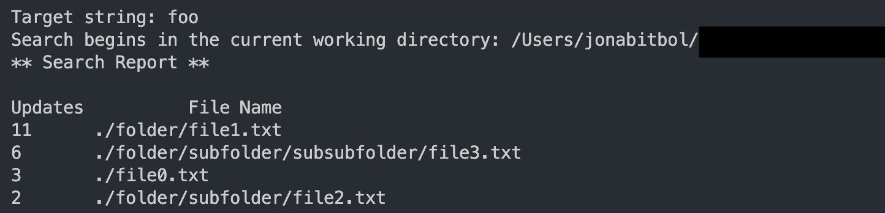

# Search And Replace 🔎📝

# Objective

This program was made with the intention to gain some hands-on experience with C.

# Description

This simple search and replace program will find a user-specified text string within a group of files recursively by going through all text files in the current directory (and sub-directories), and will modify the strings to upper-case.

It will then give a detailed and sorted report of which files were altered and how many changes were made in each of the files.

# Instructions

Firstly, make sure to have gcc on your machine. To check if you have it, refer to [this post](https://stackoverflow.com/questions/29416702/how-to-check-if-gcc-is-installed-on-my-pc#:~:text=In%20the%20Command%20Prompt%20window%20type%20%E2%80%9Cgcc%E2%80%9D%20and%20hit%20enter.&text=If%20the%20output%20says%20something,and%20you%20pass%20the%20test.).

Then, add some files or folders with text files in them into the directory with the program and run the following command in your terminal (Make sure you are in the project's directory):

```bash
gcc replace.c text.c traversal.c report.c
```

This should compile the program and generate a file named `a.out`. 

Then, to actually run the program, type the following command in the terminal: `./a.out <string to replace>`.

The program will run and output a detailed report of the changes made in each individual file like so:




Enjoy! ❤️
